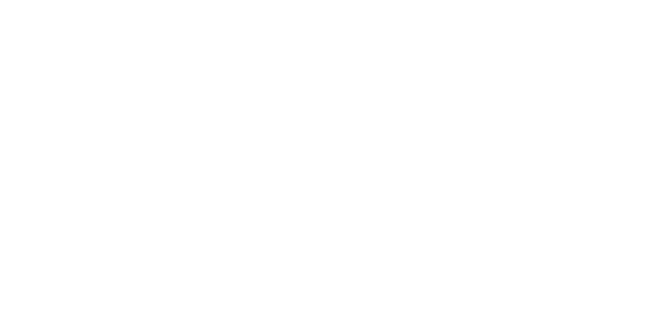

# source

[http://gopherdata.io/post/deeplearning_in_go_part_1/](http://gopherdata.io/post/deeplearning_in_go_part_1/)

# Author

Chewxy, @chewxy on Twitter and Gophers Slack

# Go语言版深度学习从零开始

# Part 1: 方程式都是图

欢迎来到第一章节，这里有很多章节关于用Go语言编写的深度学习算法。
本章目标从零开始介绍到本领域的最新发展情况。

[深度学习](https://en.wikipedia.org/wiki/Deep_learning) 不是新概念。实际上1980年代，这个术语的概念就被变更了一次。概念变更开始于我们的计算机成长为非常非常强力之后。在本片文章中我们将从熟悉的事物上开始，到构建一个深度学习的概念模型。前几章我们将不定义深度学习，所以不要担心这个术语。

在我们正确开始之前，有一些术语需要说明。在这些章节中，术语“图”(graph)是`图论`中的图的概念。其他类型的“图”用于数据可视化等，我将用术语“图表”表示。

# 计算过程

我将从一个声明开始：全部程序都可以被表示为一个图。当然，这个声明也不是新概念。不是冒进也不是改革。它是计算机科学的基础理论，甚至从计算过程诞生就开始被论证了。但是你可能会忽略它。如果你忽略它了，这里有理论说明：

1. 全部现代计算机程序运行于本质是`图灵机`的载体之上。
2. 全部图灵机是与无类型 lambda 表达式(lambda calculus)等价的。
3. lambda 表达式可以被表示为图。
4. 所以全部程序可以被表示为图。

为了让这个概念更明确，我们一起看一个示例程序：

```golang

func main() {
    fmt.Printf("%v", 1+1)
}

```

它生成一个`抽象语法树` 比如（用工具[goast-viewer](https://github.com/yuroyoro/goast-viewer)生成）：


通过这个方法，我们也可以说任何一个方程式都可以被表达为一个计算机程序，且一个计算机程序可以被表达为一个图。更细致一步，让我们关注 `1+1` 部分：

这部分等同于清理后的图（将无用的部分移除）：


图遍历使用深度优先方法，从顶端开始。程序的值从底部向上流动。当程序运行时，从右上开始。图中节点不会被解释执行直到依赖的节点求值完成。箭头指向的节点为被以来的节点。例如，`*ast.BinaryExpr`节点的值依赖于`*ast.BasicLit (Kind: INT)`节点的值。既然我们知道值都是 `1`，且我们知道 `+`的作用，我们知道`*ast.BinaryExpr` 节点的值为 `2`。

# 方程式 视为 图

现在，我们为什么花时间用图的形式展示1+1？好，这是因为深度学习的核心就是一组数学方程式。等下，别跑！它没有那么恐怖。我个人的观点是一个人不明白背后的数学知识不能真正地做深度学习（或其他机器学习）。同时，我的经验是没有比可视化更好的方法去学习它，如果仅为了学通理论。

大多数深度学习库比如`Tensorflow`，`Theano`，或者我的为了Go语言的 - `Gorgonia`，都依赖这个核心理念方程式能被描绘为图。更重要的是，这些库以对象方式导出方程式图，对象可以被程序员操作。

下面，替换上面的程序，我们写如下程序：

```golang
func main() {
	// Create a graph.
	g := G.NewGraph()                         
	
	// Create a node called "x" with the value 1.
	x := G.NodeFromAny(g, 1, G.WithName("x")) 
	
	// Create a node called "y" with the value 1.
	y := G.NodeFromAny(g, 1, G.WithName("y")) 
	
	// z := x + y
	z := G.Must(G.Add(x, y))                  

	// Create a VM to execute the graph.
	vm := G.NewTapeMachine(g) 

	// Run the VM. Errors are not checked.
	vm.RunAll()               

	// Print the value of z.
	fmt.Printf("%v", z.Value()) 
}

```

方程式图看起来像这样：



# 为什么用图对象？

到这里，你可能在想 - 如果全部计算机程序是图，且全部数学方程式是图，我们可以仅编写数学方程式进来，对吧？上面例子中，描述`fmt.Printf("%v", 1+1)`能做什么为什么要用图对象？毕竟，这些图都大多一样。在这点上使用图对象好似一个愚蠢的高代价。

你可能是对的。对于简单方程式，使用一个程序员可操作的图对象确实是大炮打蚊子（除非你住在java大陆，那里它的类都是这样）。

我可以，但是，假定至少3个使用图对象的优势。这些优势都可以用来减少人工错误。

# 数值稳定性

考虑这样一个方程式 y=log(1+x)。这个方程式不是数值稳定的 - 那些非常小的 `x`，结果将极可能错误。
这是因为`float64`的定义 - 一个 `float64` 没有足够的bit来区分 `1` 和 `1+10e-16`。
实际上，正确的方法处理 y=log(1+x) 是用内置库函数 `math.Log1p`。
显示效果如下示例程序:

```golang

func main() {
	fmt.Printf("%v\n", math.Log(1.0+10e-16))
	fmt.Printf("%v\n", math.Log1p(10e-16))
}

1.110223024625156e-15 // wrong
9.999999999999995e-16 // correct

```

现在，当然，程序员可以很好地避免这类问题，当实现神经网络算法时选择使用`math.Log1p`，但是，我确信你将同意有一个库自动将 `log(1+x)`转换为`math.Log1p(x)`会更棒？这样会减少人工错误的元素。

# 机器学习调优

考虑本篇第一个程序的变体：

```golang
func a() int {
	return 1 + 1
}
```

这是同样的程序被编译成汇编指令：

```s
"".a t=1 size=10 args=0x8 locals=0x0
	(main.go:5)	TEXT	"".a(SB), $0-8
	(main.go:5)	FUNCDATA	$0, gclocals·2a5305abe05176240e61b8620e19a815(SB)
	(main.go:5)	FUNCDATA	$1, gclocals·33cdeccccebe80329f1fdbee7f5874cb(SB)
	(main.go:6)	MOVQ	$2, "".~r0+8(FP)
	(main.go:6)	RET
```

详细说，注意倒数第二行： `MOVQ $2, "".~r0+8(FP)`。这个函数已经被优化成返回`2`。
在运行期，没有加法操作被执行。
这是因为编译器知道，在编译期知道，1+1=2。通过用常数替换一个表达式，编译器节省了运行期的计算周期。
如果你对构建编译器感兴趣，这里可以参考[常量折叠式](https://en.wikipedia.org/wiki/Constant_folding)。

所以，我们已经确认编译器足够聪明去做优化。
但是Go语言编译器（和实际上大多数非机器学习专用编译器）不是足够聪明去处理被机器学习使用的值。
为了机器学习，我们经常使用向量类型的值，比如一数组的`float64`，或一矩阵的`float32`。

如果你可以想象，如果你不是在处理 `1+1`。
你在处理`[]int{1, 1, 1} + []int{1,1,1}`。
编译器将不能优化这个并将之替换为`[]int{2, 2, 2}`。
但是，构建一个图对象，允许用户去做这个优化。
Gorgonia 暂不处理常量折叠（早期版本有常量折叠但它非常困难去执行正确），但它带来其他形式的图优化比如[通用表达式精简](https://en.wikipedia.org/wiki/Common_subexpression_elimination)，一些变量总和精简与一些树结构最小化。
其他更成熟库比如TensorFlow 或 Theano 带有非常多的优化算法给他们的图。

重申，人可以争论这个可以被手工处理，且把它写成程序将更可行。
但是这是你更希望化时间和精力的地方么？
或者你可以创建最酷的新深度学习设备？

# 反向传播算法

最近，更重要的，图对象是最重要的反向传播算法的实现。
接下来几篇文章，我将简述反向传播算法和它怎样与计算偏微分进行关联。
它是我们将看见使用程序员可控图对象真正力量的地方。

在接下来的几篇中，我将同时涉及使用图对象生成更好的代码的话题。

# 为什么用Go语言？

如果你正工作在真正的同像性语言比如 lisp 或者 Julia，你可能将不需要一个图对象。
如果你可能有机会访问程序本质数据结构且他们是运行期可修改的，你将有能力去增加操作的余地（是的，你可以同样扩展Go语言，但是为什么呢？）。
这将使反向传播算法在运行期更容易实现。
不幸的是，不是这样。
这就是为什么我们必须为深度学习构建一个额外的数据结构。

请注意到这不是责备Go 或者 Python 或者 Lua。
这些语言都有他们的长处和短处。
但是为什么处理深度学习的工作用Go语言当已经有很多Python 或 Lua 库的时候？
好的，一个主要原因促使我开发Gorgonia 是把几乎所有东西编译进一个bin文件中。
用Python 或 Lua 这么做会花费大量的精力。
开发Go程序就很简单了。

我相信数据科学用Go语言是一个神奇的注意。
它是类型安全的（对我足够了），且它可以编译成一个bin文件。
Go语言更亲和机器，我相信这是一个关键，促使更快更好的AI从这里诞生。
毕竟，我们全被我们的硬件束缚。
我仅希望有一个更好更高级的数据结构给我来实现我的主意。
没有，我就构建他们。
同时，我希望你使用他们。

